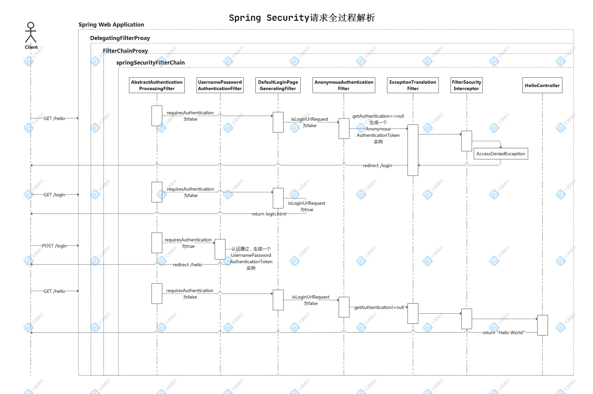
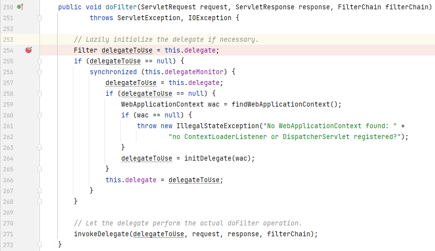
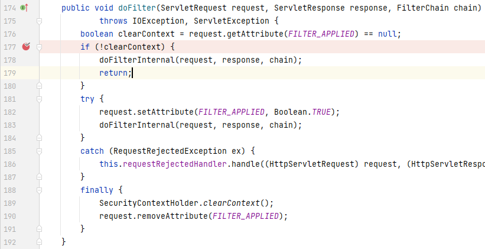
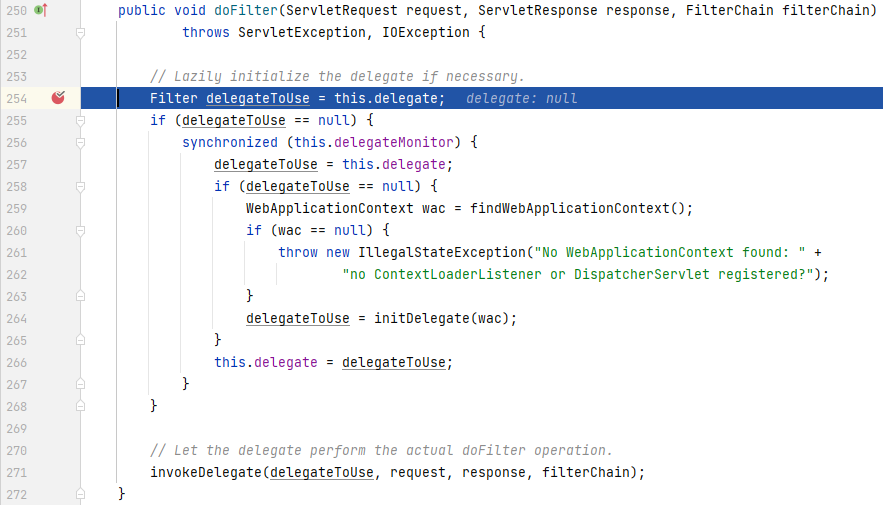
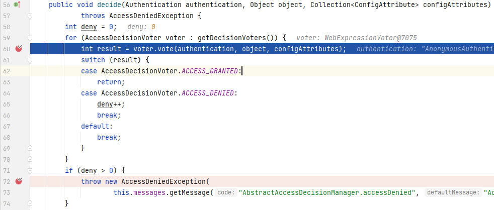
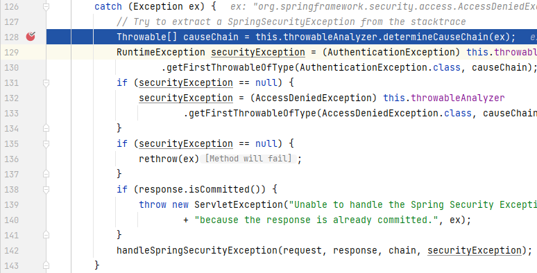

# Spring Security 请求全过程解析

Spring Security 是一款基于 Spring 的安全框架，主要包含认证和授权两大安全模块，和另外一款流行的安全框架 Apache Shiro 相比，它拥有更为强大的功能。Spring Security 也可以轻松的自定义扩展以满足各种需求，并且对常见的 Web 安全攻击提供了防护支持。如果你的 Web 框架选择的是 Spring，那么在安全方面 Spring Security 会是一个不错的选择。

这里我们使用 Spring Boot 来集成 Spring Security，Spring Boot 版本为**_2.5.3_**，Spring Security 版本为**_5.5.1_**。

## 开启 Spring Security

使用 IDEA 创建一个 Spring Boot 项目，然后引入**_spring-boot-starter-security_**：

```java
dependencies {
    implementation 'org.springframework.boot:spring-boot-starter-security'
    implementation 'org.springframework.boot:spring-boot-starter-web'
    implementation 'org.projectlombok:lombok:1.18.8'
    annotationProcessor 'org.projectlombok:lombok:1.18.8'
    providedRuntime 'org.springframework.boot:spring-boot-starter-tomcat'
    testImplementation 'org.springframework.boot:spring-boot-starter-test'
    testImplementation 'org.springframework.security:spring-security-test'
}
```

接下来我们创建一个**_HelloController_**，对外提供一个<strong><i>/hello</i></strong>服务：

```java
@RestController
public class HelloController {
    @GetMapping("hello")
    public String hello() {
        return "hello world";
    }
}
```

这时候我们直接启动项目，访问<strong><i>http://localhost:8080/hello</i></strong>，可以看到页面跳转到一个登陆页面：


默认的用户名为 user，密码由 Sping Security 自动生成，回到 IDEA 的控制台，可以找到密码信息：

```java
Using generated security password: 4f06ba04-37e9-4bdd-a085-3305260da0d6
```

输入用户名 user，密码 4f06ba04-37e9-4bdd-a085-3305260da0d6 后，我们便可以成功访问<strong><i>/hello</i></strong>接口。

## 基本原理

Spring Security 默认为我们开启了一个简单的安全配置，下面让我们来了解其原理。

当 Spring Boot 项目配置了 Spring Security 后，Spring Security 的整个加载过程如下图所示：


而当我们访问<strong><i>http://localhost:8080/hello</i></strong>时，代码的整个执行过程如下图所示：



如上图所示，Spring Security 包含了众多的过滤器，这些过滤器形成了一条链，所有请求都必须通过这些过滤器后才能成功访问到资源。

下面我们通过 debug 来验证这个过程：

首先，通过前面可以知道，当有请求来到时，最先由**_DelegatingFilterProxy_**负责接收，因此在**_DelegatingFilterProxy_**的<strong><i>doFilter()</i></strong>的首行打上断点：



接着**_DelegatingFilterProxy_**会将请求委派给**_FilterChainProxy_**进行处理，在**_FilterChainProxy_**的首行打上断点：



**_FilterChainProxy_**会在<strong><i>doFilterInternal()</i></strong>中生成一个内部类**_VirtualFilterChain_**的实例，以此来调用 Spring Security 的整条过滤器链，在**_VirtualFilterChain_**的<strong><i>doFilter()</i></strong>首行打上断点：


接下来**_VirtualFilterChain_**会通过**_currentPosition_**依次调用存在**_additionalFilters_**中的过滤器，其中比较重要的几个过滤器有：**_UsernamePasswordAuthenticationFilter_**、**_DefaultLoginPageGeneratingFilter_**、**_AnonymousAuthenticationFilter_**、**_ExceptionTranslationFilter_**、**_FilterSecurityInterceptor_**，我们依次在这些过滤器的<strong><i>doFilter()</i></strong>的首行打上断点：


准备完毕后，我们启动项目，然后访问<strong><i>http://localhost:8080/hello</i></strong>，程序首先跳转到**_DelegatingFilterProxy_**的断点上：



此时**_delegate_**还是 null 的，接下来依次执行代码，可以看到**_delegate_**最终被赋值一个**_FilterChainProxy_**的实例：


接下来程序依次跳转到**_FilterChainProxy_**的<strong><i>doFilter()</i></strong>和**_VirtualFilterChain_**的<strong><i>doFilter()</i></strong>中：


接着程序跳转到**_AbstractAuthenticationProcessingFilter_**（**_UsernamePasswordAuthenticationFilter_**的父类）的<strong><i>doFilter()</i></strong>中，通过<strong><i>requiresAuthentication()</i></strong>判定为 false（是否是 POST 请求）：


接着程序跳转到**_DefaultLoginPageGeneratingFilter_**的<strong><i>doFilter()</i></strong>中，通过<strong><i>isLoginUrlRequest()</i></strong>判定为 false（请求路径是否是<strong><i>/login</i></strong>）：


接着程序跳转到**_AnonymousAuthenticationFilter_**的<strong><i>doFilter()</i></strong>中，由于是首次请求，此时<strong><i>SecurityContextHolder.getContext().getAuthentication()</i></strong>为 null，因此会生成一个**_AnonymousAuthenticationToken_**的实例：


接着程序跳转到**_ExceptionTranslationFilter_**的<strong><i>doFilter()</i></strong>中，**_ExceptionTranslationFilter_**负责处理**_FilterSecurityInterceptor_**抛出的异常，我们在 catch 代码块的首行打上断点：

****

接着程序跳转到**_FilterSecurityInterceptor_**的<strong><i>doFilter()</i></strong>中，依次执行代码后程序停留在其父类(**_AbstractSecurityInterceptor_**)的<strong><i>attemptAuthorization()</i></strong>中：


**_accessDecisionManager_**是**_AccessDecisionManager_**(访问决策器)的实例，**_AccessDecisionManager_**主要有 3 个实现类：**_AffirmativeBased_**(一票通过)，**ConsensusBased**(少数服从多数)、UnanimousBased(一票否决)，此时**_AccessDecisionManager_**的的实现类是**_AffirmativeBased_**，我们可以看到程序进入**_AffirmativeBased_**的<strong><i>decide()</i></strong>中：



从上图可以看出，决策的关键在<strong><i>voter.vote(authentication, object, configAttributes)</i></strong>这句代码上，通过跟踪调试，程序最终进入**_AuthenticationTrustResolverImpl_**的<strong><i>isAnonymous()</i></strong>中：


<strong><i>isAssignableFrom()</i></strong>判断前者是否是后者的父类，而**_anonymousClass_**被固定为**_AnonymousAuthenticationToken.class_**，参数**_authentication_**由前面**_AnonymousAuthenticationFilter_**可以知道是**_AnonymousAuthenticationToken_**的实例，因此<strong><i>isAnonymous()</i></strong>返回 true，**_FilterSecurityInterceptor_**抛出**_AccessDeniedException_**异常，程序返回**_ExceptionTranslationFilter_**的 catch 块中：



接着程序会依次进入**_DelegatingAuthenticationEntryPoint_**、**_LoginUrlAuthenticationEntryPoint_**中，最后由**_LoginUrlAuthenticationEntryPoint_**的<strong><i>commence()</i></strong>决定重定向到<strong><i>/login</i></strong>：


后续对<strong><i>/login</i></strong>的请求同样会经过之前的执行流程，在**_DefaultLoginPageGeneratingFilter_**的<strong><i>doFilter()</i></strong>中，通过<strong><i>isLoginUrlRequest()</i></strong>判定为 true（请求路径是否是<strong><i>/login</i></strong>）,直接返回**_login.html_**，也就是我们开头看到的登录页面。

当我们输入用户名和密码，点击**_Sign in_**，程序来到**_AbstractAuthenticationProcessingFilter_**的<strong><i>doFilter()</i></strong>中，通过<strong><i>requiresAuthentication()</i></strong>判定为 true（是否是 POST 请求）,因此交给其子类**_UsernamePasswordAuthenticationFilter_**进行处理，**_UsernamePasswordAuthenticationFilter_**会将用户名和密码封装成一个**_UsernamePasswordAuthenticationToken_**的实例并进行校验，当校验通过后会将请求重定向到我们一开始请求的路径：<strong><i>/hello</i></strong>。

后续对<strong><i>/hello</i></strong>的请求经过过滤器链时就可以一路开绿灯直到最终交由**_HelloController_**返回"Hello World"。

## 参考

1. [Spring Security Reference](https://docs.spring.io/spring-security/site/docs/current/reference/html5/)

2. [Spring Boot 中开启 Spring Security](https://mrbird.cc/Spring-Boot&Spring-Security.html)
